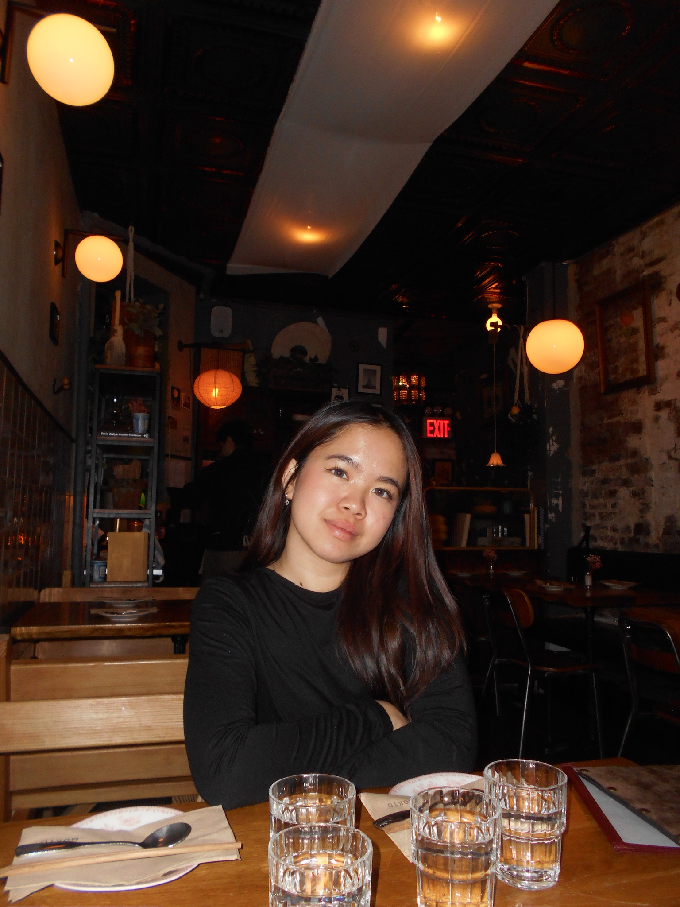
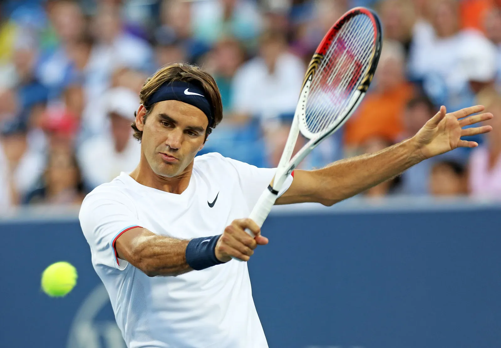

# Nicole Sutedja's User Page
## About Me 


Hi! My name is Nicole and I am currently a 2nd year Computer Science major at UCSD, originally from Indonesia and now residing in San Bernandino.
Some clubs I'm involved in are **CS foreach, CSES, San Diego Indonesian Association, and Triton Web Developers**. Outside of school and CS, I also like to:
- Play tennis & watch my [favorite tennis players](#my-top-three-favorite-tennis-players)
- Play videogames
- Create art

Overall, I am excited to take CSE 110 and work alongside a team. Looking forward to seeing how this quarter will help to develop my technical and personal skills!

### A Quote I Like
> Embrace the **messiness of learning**. <br>
> by Kay Chung

### Git Commands I learned
```
git log
git reset HEAD~1
git checkout
```
### My Top Three Favorite Tennis Players


1. Roger Federer
2. Rafael Nadal
3. Emma Raducanu


### To-do's for this Quarter
- [x] Attend a hackathon for the first time!
- [x] Finish CSE 110 Lab 1
- [ ] Spend more time with friends & family

## Where to find me
My email is nsutedja@ucsd.edu but you can also find me on [LinkedIn](https://www.linkedin.com/in/nicolesutedja/).

Check out my [README](https://nicolesutedja.github.io/CSE110-Lab1/README.md)!